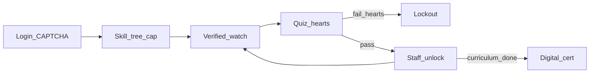

# Architecture

## Overview

```text
Browser
   │  HTTPS (same origin)
   ▼
Traefik ──► frontend (Next.js :3000)   paths: UI
        └──► backend  (Go :8080)       paths: /api/*, /media/*, /c/* (via FE + API)
                │
                ├── Postgres   (stateful: users, progress, chats, certs, …)
                ├── Redis      (rate limit, captcha, refresh metadata, pub/sub WS)
                └── Object storage (RustFS/S3)  videos, avatars, chat attachments
```

- **One public origin:** the browser talks only to the public domain; Traefik splits paths.
- **Backend** owns business logic, auth, media signing, and WebSocket.
- **Frontend** is an App Router SPA; data comes from React Query with `credentials: "include"`.

Edge path details: [deployment.md](deployment.md#routing)

## Backend packages

| Package | Role |
|---------|------|
| `internal/api` | HTTP handlers, middleware, captcha, rate limit, cookies |
| `internal/store` | Postgres access |
| `internal/config` | Env loading and `Validate()` |
| `internal/storage` | Local / S3; `EnsureSampleMP4` at startup |
| `internal/seed` | Admin bootstrap + optional curriculum |
| `internal/db/migrations` | Ordered SQL |
| `cmd/server` | Process entrypoint |

## Learning flow (core)



1. Watch accumulates verified time via anti-cheat heartbeats until the completion threshold.
2. Quizzes spend hearts; zero → `/lockout` until staff reopens the account.
3. Unlocking the next lesson is **staff-only**; the student requests it and follows up in chat.
4. Completing the curriculum → unlisted digital certificate; physical copy is optional and offline.

## Sessions and realtime

- Browser session: HttpOnly cookies `pargar_access` / `pargar_refresh` (+ JSON tokens for non-browser clients). Details: [security.md](security.md).
- WebSocket: `GET /api/ws` — Bearer, `Sec-WebSocket-Protocol: bearer,<jwt>`, or same-origin access cookie.
- Hub coordinates across replicas via Redis pub/sub (online presence is per-process).

## Media storage

- Lesson keys (e.g. `sample.mp4`) live in object storage; browser URLs are short-lived HMAC-signed.
- At startup, if the sample key is missing, `backend/media/sample.mp4` is uploaded.
- Chat / avatar / admin video uploads use content sniffing (not extension alone).

## Errors and observability

- Error body: JSON `{ error, code, requestId }` plus `X-Request-ID`.
- Frontend: `toUserError`, toasts for mutations, empty vs error states in lists.
- Prometheus metrics on `/metrics` (requires `METRICS_TOKEN` outside DevMode).
- Optional OTLP via `OTEL_*`.
